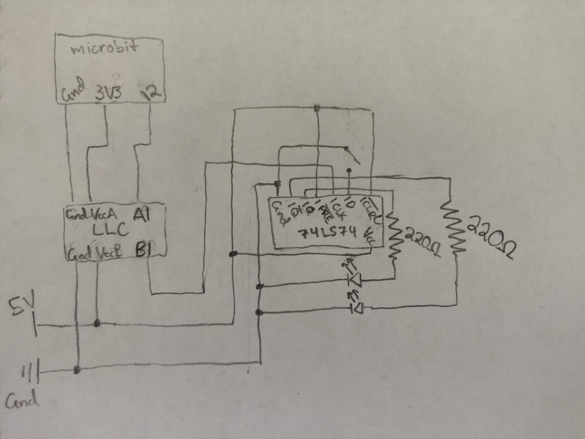
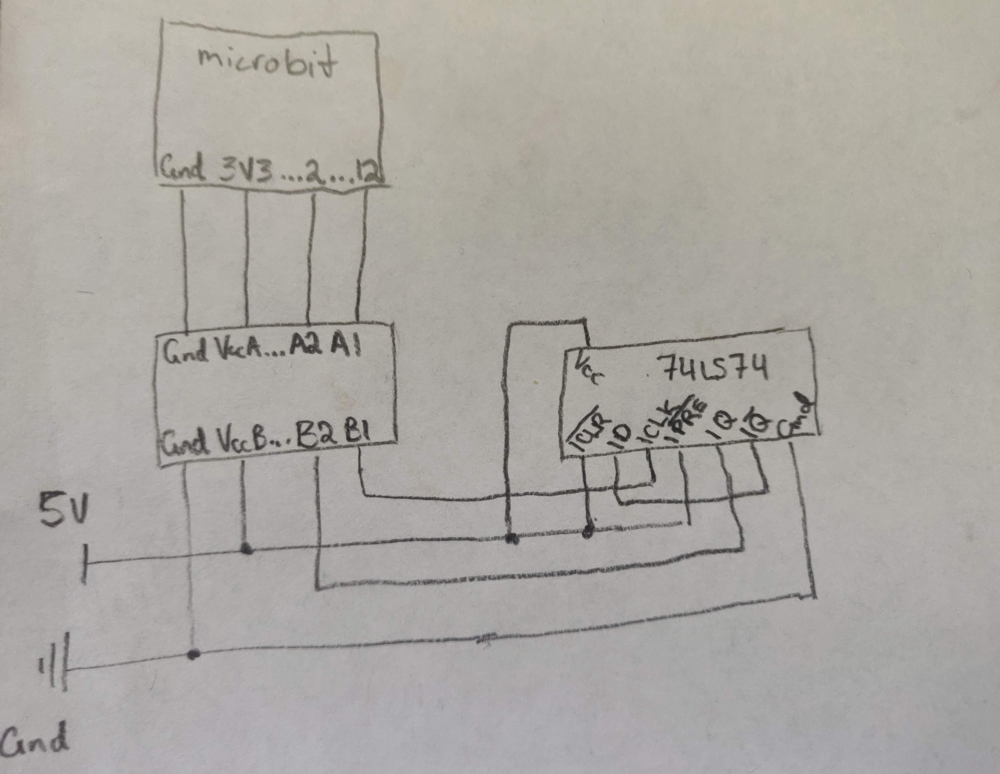
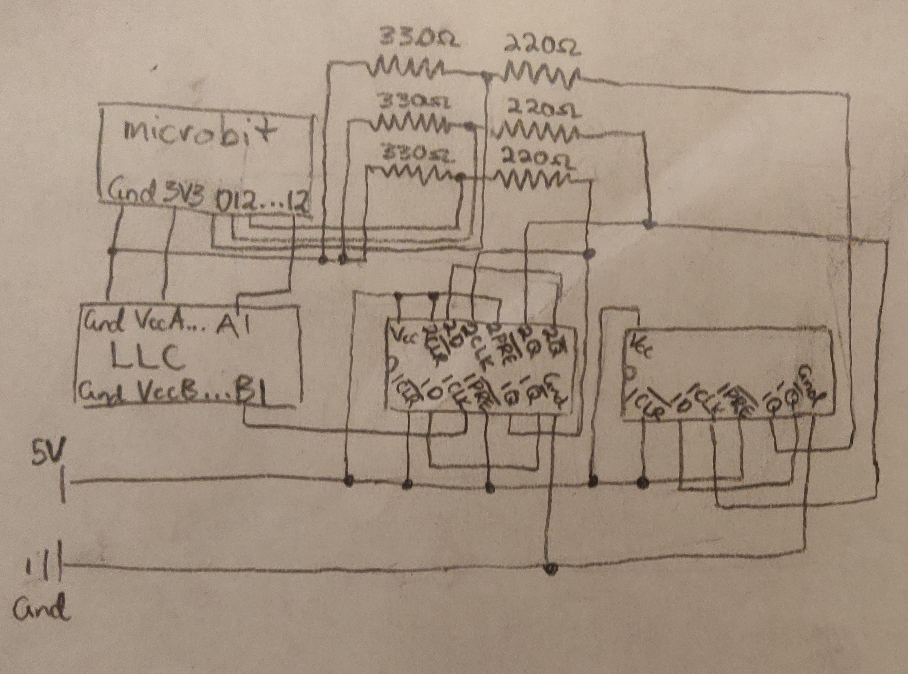

# CPE 1040 - Spring 2020
```
  _           _       _   _       _       _                 _    
 | |         | |     | \ | |     | |     | |               | |   
 | |     __ _| |__   |  \| | ___ | |_ ___| |__   ___   ___ | | __
 | |    / _` | '_ \  | . ` |/ _ \| __/ _ \ '_ \ / _ \ / _ \| |/ /
 | |___| (_| | |_) | | |\  | (_) | ||  __/ |_) | (_) | (_) |   < 
 |______\__,_|_.__/  |_| \_|\___/ \__\___|_.__/ \___/ \___/|_|\_\
                                                                                                                      
```
Art acknowledgement: [taag](http://patorjk.com/software/taag/)
---

**NOTE:** 
1. This lesson & assignment [README](README.md) is _intentionally_ blank, to be used as the Lab Notebook for the study & submission. _It is a great aid for your study and the main component of your submission._
2. Read and follow the [lesson-and-assignment](lesson-and-assignment.md).
2. Refer to the [submission template](submission-template.md) for formatting expectations and examples. 
4. Refer to the [criteria and guide](criteria-and-guide.md) for the different components of your submission.
---

## Section 1: Capacitors
1. In this experiment, the capacitor is connected in series with a resistor to the 5V power source. After the capacitor receives the charge, it is disconnected from the power supply circuit and quickly moved to another circuit consisting of only the capacitor and an LED. The LED shines brightly for a few moments before it begins fading as the capacitor loses its charge.
When the capacitor is finished charging, its voltage remains at 5V. This is because the capacitor inherits the voltage of the source it was charged from.
 2. The amount of time the current read above zero while charging was approximately 8 seconds, and while discharging it was 17 seconds.
 3. On both multimeters that I have access to, the current was not able to be read using the current settings on the dial. Instead, the voltage through a 10Ω resistor was measured and converted to current using Ohm's Law. While charging the highest value read was I=76.3mV/10Ω=7.6mA, and while discharging the highest value read was I=113.2mv/10Ω=11.3mA.

## Section 2: Logic Level Converter
1. The logic level converter takes signals from a high voltage and converts them to a low voltage, or vice versa. This experiment is a proof-of-concept.
The first part shows that the 5V source of the power supply can be converted to a 3.3V signal which can in turn be read by the microbit. The code running on the microbit simply powers an LED on the built-in LED array when a digital high signal is read from pin 12.
The second part demonstrates that this process also works in the opposite direction. This code causes pin 12 to output a digital high signal when the user presses the "B" button, this is then converted to a 5V signal that powers an LED.
2. [Video Demo of 2.2.3](https://i.imgur.com/5mTvyty.mp4)
3. [Video Demo of 2.2.5](https://i.imgur.com/Oi8cfG8.mp4)

## Section 3: Clock Signal from the Microbit
1. This experiment uses the microbit with a simple program to generate a clock signal that drives the LED. In the first part, the clock frequency is set to 400ms (200ms low, and 200ms high). In the second part, the buttons on the microbit can be used to double or halve the frequency.
2. [Video Demo of 3.2.2](https://i.imgur.com/tTOPdqc.mp4)
3. [Video Demo of 3.2.3](https://i.imgur.com/ucOMod8.mp4)

## Section 4: D-Type Flip-Flop
1. In this experiment, the 74LS74 d-type flip-flop chip was tested. This chip was connected to 5V power and ground, the outputs Q and Q-prime were wired to LEDs, and the microbit clock to logic-level converter (LLC) circuit constructed in section 3 was used as the clock input for the chip. The preset and clear pins were wired to the high voltage, so that the d-input would cause the ouput to change on the rising edge of the clock pulse. I added a button to the circuit to more easily change the d-input.
2. 


3. This shows the clock running at a slow rate to demonstrate that the ouput is only changed on the rising edge of the clock. [Video Demo of 4.2.6](https://i.imgur.com/kqopfRn.mp4)
4. This shows the clock running much faster to show that at a higher clock speed the lag between the change of the input and the outputs is imperceptible. [Video Demo of 4.2.7](https://i.imgur.com/YpNDISR.mp4)

## Section 5: Reading Flip-Flop Output with the Microbit
1. In this experiment, the microbit is used to set the clock speed, with the LED in the top left (0,0) of the pixel array representing the speed of the clock ticks. The 74LS74 chip is powered and the CLR and PRE pins are plugged into the 5V line, as in section 4. However, the LEDs from the previous experiment have been disconnected and the Q-prime output is now used as the D input which causes the output to flip to its opposite at the beggining of the next clock cycle. The Q output is connected to the LLC, which is then sent to the microbit as a 3.3V signal. The microbit reads this signal from pin 2 and uses the on-pulsed event handler to control the LED below the clock speed indicator (0,1). This LED turns on when it detects a high voltage and turns off when it detects a low voltage.
2. Section 5.1 Questions:
    1. In a program, an *event* is an input that causes a subroutine in the program to execute, and an *event handler* is a function that detects the input event and ensures that the subroutine runs as a result. *Asynchronous execution* is a type of programming that causes parts of a program to execute separately from the main function.
    2. The onPulsed function is similar to the onButtonPressed and onGesture functions that have been used in previous projects.
    3. In this case, the event being handled is the "pulse," or the rising and falling voltage output by the flip flop.
    4. The event handler is the onPulsed function, which is reading the digital pin and executing a function based on this input.
    5. The events that can be specified by the event handler are a high voltage reading and a low voltage reading.
    6. The second argument of onPulsed should be specified as high or low.
3. Section 5.2 Questions:
    1. With this set up, the Q output of the flip flop changes at half the rate of the clock speed. On the rising edge of the clock's square wave, the output changes to its opposite and it changes back on the next rising edge.
4.


5. [Video Demo of 5.2.4](https://i.imgur.com/rgeVcCj.mp4)

## Section 6: 3-bit Counter
1. In this experiment, a second 74LS74 chip was added to create a 3-bit mod-8 counter. Each of the chips were connected as described in 2-iii below and the outputs were read by the microbit and displayed on the LED matrix. In the previous experiment, I ran into difficulty reading the Q output with the microbit: the behavior was erratic, but occasionally gave the correct result. After further testing during this experiment, I determined that LLC was tending to output only 2.4V rather than the intended 3.3V. To solve this issue with the resources at hand, I created three voltage divider circuits, each consisting of a 330Ω and a 220Ω resistor. Connecting my multimeter to the middle of this circuit, I was able to verify that they were each producing approximately 3V. These were then wired to the microbit pins (0-2) which yielded the intended result: a functioning 3-bit counter.
2. Section 6.1 Questions:
    1. A mod-n counter has 2^n possible output states. 
    2. To represent some number N in binary, the number of bits required (n) can be determined by finding the lowest value for which 2^n > N.
    3. The first flip flop in the mod-8 counter works by using the output of Q-prime as the input to D, to cause the output to alternate at the beginning of next clock cycle. Because this alternates only at that the beginning of each clock cycle, the frequency is of the alternating signal (Q or b0) is half of the clock speed. The Q output is the first output bit and is also used as the clock input for the second flip flop, and the second flip flop's Q output (b1) is used as the clock input for the third flip flop. All three have Q-prime connected to D, so each successive flip flop alternates between on and off half as quickly as the one before it. If each of the Q outputs are connected to LEDs, the LEDs display the numbers 0-7 in binary.
    4. The only input to the mod-8 counter is the clock signal.
    5. The Q-prime output and D input do not interfere with each other because the flip flop does not change its state until the beginning of the next clock cycle.
    6. In the diagram, the high voltage represents a 1 and the low voltage represents a 0.
3. Section 6.2 Questions:
    1. The bit coming out of the first flip flop in the chain is the lowest order bit, representing 2^0, with the next two flip flops in the chain representing 2^1 and 2^2, respectively.
    2. The high and low pulse events at which the LED was triggered in the previous experiment, are also the events that will trigger the LEDs in this experiment.
    3. The circuit does produce a 3-bit mod-8 counter. The code running on the microbit displays the inputs as counting upward, however connecting three LEDs directly to the ouputs shows the outputs counting downward. After experimenting with the circuit, I have concluded that the microbit is displaying the inverse of the output that it is receiving. Given that the code is set to unplot an LED on a low pulse, and plot an LED on a high pulse, I am not sure why this is. The direction of the counting is not effected by switching the circuit on and off repeatedly because the starting conditions are the same each time as PRE and CLR connected to the 5V line. To display counting in the opposite direction, the ouput LEDs must be connected to Q-prime.
4.


5. [Video Demo of 6.2.6](https://i.imgur.com/6gScT4X.mp4)

## Section 7: Decoded Binary-to-Decimal Microbit Output
1. This experiment simply built on the software of the previous one. The pin event functions were changed to read low pulses as 0s and high pulses as 1s. A bin2dec() function was added to decode these binary pin values and display a decimal number. And finally, a second forever loop was added to continuously run the bin2dec() function without being interrupted by the basic.pause() functions in the other forever loop.
2. Section 7.1 Questions:
    1. A 8 binary bits can represent 0-7, meaning they can be represented by one decimal digit.
    2. An event is some asynchronous input that causes the state of the program to change. The event handler is constantly polling, or "listening" for this asynchronous input so that it does not miss the input while it is executing other instructions.
    3. The microbit achieves the illusion of executing multiple instructions at the same time by executing millions of instructions per second and thus being able to alternate among many different sets of instructions one after another in quick succession.
    4. The scheduler determines which subprograms will be run, in what sequence, and when to wake a function that is "sleeping."
    5. Using two separate forever loops allows the clock to be handled by the basic.pause() function without interrupting the exection of the bin2dec() function. With two forever loops, the scheduler is able to continuously run the bin2dec function and also watch the sleep timers and send the clock signals at the right time.
 3. Section 7.2 Questions:
    1. At the default 400 microsecond clock speed, the output does not display correctly: some numbers are skipped.
    2. Yes, at 400 microseconds, some numbers are displayed noticeably longer than others.
    3. The skew is no longer noticeable after halving the clock speed a couple of times. This is because with some extra time the program has enough time to display the current number and change to the next one. At the faster clock speeds, the program is still displaying the previous number when it receives the signal that it needs to change to the next one.
    4. The LED does not blink evenly with the clock because the basic.showNumber() function plots and unplots the (0,0) LED separately from the led.plot() and led.unplot() commands in the forever loop.
    5. Separating the functions into serparate forever loops causes the scheduler to continuously flip back and forth between checking sleep timer and running the bin2dec() function. If there was one forever loop that did not use the sleep function, but instead continuously checked the runtime of the program, some of the synchronization problems may be solved.
4. [Video Demo of 7.2.2]()
