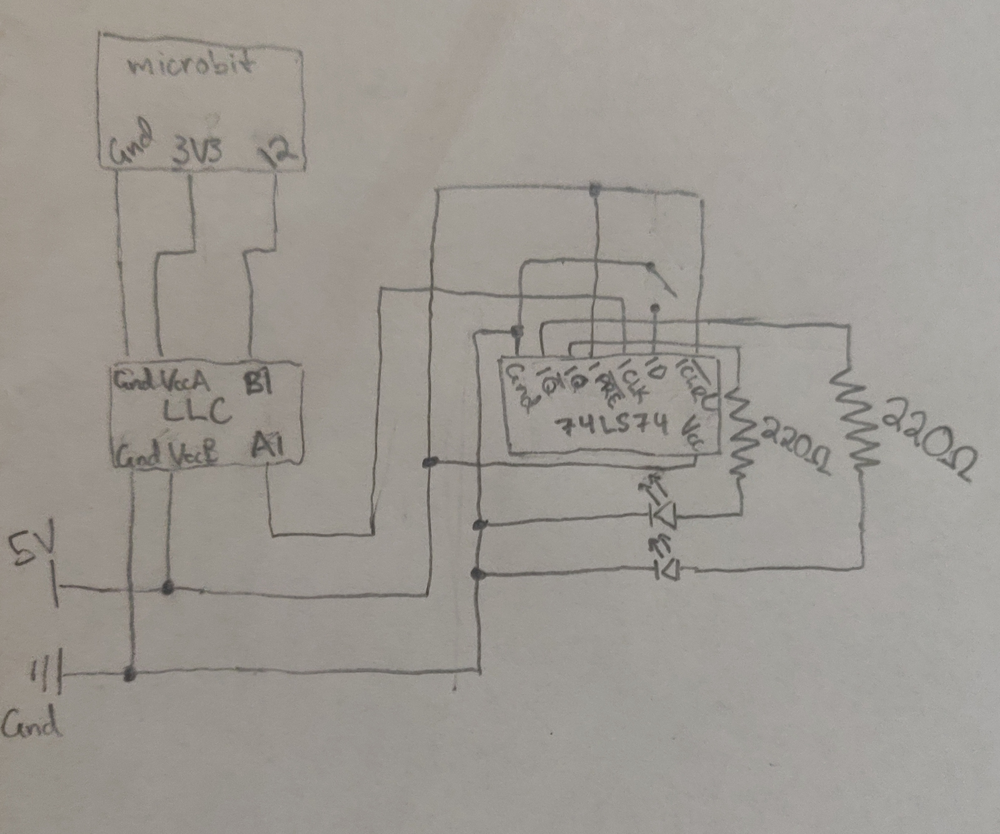

# CPE 1040 - Spring 2020
```
  _           _       _   _       _       _                 _    
 | |         | |     | \ | |     | |     | |               | |   
 | |     __ _| |__   |  \| | ___ | |_ ___| |__   ___   ___ | | __
 | |    / _` | '_ \  | . ` |/ _ \| __/ _ \ '_ \ / _ \ / _ \| |/ /
 | |___| (_| | |_) | | |\  | (_) | ||  __/ |_) | (_) | (_) |   < 
 |______\__,_|_.__/  |_| \_|\___/ \__\___|_.__/ \___/ \___/|_|\_\
                                                                                                                      
```
Art acknowledgement: [taag](http://patorjk.com/software/taag/)
---

**NOTE:** 
1. This lesson & assignment [README](README.md) is _intentionally_ blank, to be used as the Lab Notebook for the study & submission. _It is a great aid for your study and the main component of your submission._
2. Read and follow the [lesson-and-assignment](lesson-and-assignment.md).
2. Refer to the [submission template](submission-template.md) for formatting expectations and examples. 
4. Refer to the [criteria and guide](criteria-and-guide.md) for the different components of your submission.
---

## Section 1: Capacitors
1. In this experiment, the capacitor is connected in series with a resistor to the 5V power source. After the capacitor receives the charge, it is disconnected from the power supply circuit and quickly moved to another circuit consisting of only the capacitor and an LED. The LED shines brightly for a few moments before it begins fading as the capacitor loses its charge.
When the capacitor is finished charging, its voltage remains at 5V. This is because the capacitor inherits the voltage of the source it was charged from.
 2. The amount of time the current read above zero while charging was approximately 8 seconds, and while discharging it was 17 seconds.
 3. On both multimeters that I have access to, the current was not able to be read using the current settings on the dial. Instead, the voltage through a 10Ω resistor was measured and converted to current using Ohm's Law. While charging the highest value read was I=76.3mV/10Ω=7.6mA, and while discharging the highest value read was I=113.2mv/10Ω=11.3mA.

## Section 2: Logic Level Converter
1. The logic level converter takes signals from a high voltage and converts them to a low voltage, or vice versa. This experiment is a proof-of-concept.
The first part shows that the 5V source of the power supply can be converted to a 3.3V signal which can in turn be read by the microbit. The code running on the microbit simply powers an LED on the built-in LED array when a digital high signal is read from pin 12.
The second part demonstrates that this process also works in the opposite direction. This code causes pin 12 to output a digital high signal when the user presses the "B" button, this is then converted to a 5V signal that powers an LED.
2. [Video Demo of 2.2.3](https://i.imgur.com/5mTvyty.mp4)
3. [Video Demo of 2.2.5](https://i.imgur.com/Oi8cfG8.mp4)

## Section 3: Clock Signal from the Microbit
1. This experiment uses the microbit with a simple program to generate a clock signal that drives the LED. In the first part, the clock frequency is set to 400ms (200ms low, and 200ms high). In the second part, the buttons on the microbit can be used to double or halve the frequency.
2. [Video Demo of 3.2.2](https://i.imgur.com/tTOPdqc.mp4)
3. [Video Demo of 3.2.3](https://i.imgur.com/ucOMod8.mp4)

## Section 4: D-Type Flip-Flop
1. In this experiment, the 74LS74 d-type flip-flop chip was tested. This chip was connected to 5V power and ground, the outputs Q and Q-prime were wired to LEDs, and the microbit clock to logic-level converter circuit constructed in section 3 was used as the clock input for the chip. The preset and clear pins were wired to the high voltage, so that the d-input would cause the ouput to change on the rising edge of the clock pulse. I added a button to the circuit to more easily change the d-input.
2. 

3. This shows the clock running at a slow rate to demonstrate that the ouput is only changed on the rising edge of the clock. [Video Demo of 4.2.6](https://i.imgur.com/kqopfRn.mp4)

4. This shows the clock running much faster to show that at a higher clock speed the lag between the change of the input and the outputs is imperceptible. [Video Demo of 4.2.7](https://i.imgur.com/YpNDISR.mp4)
